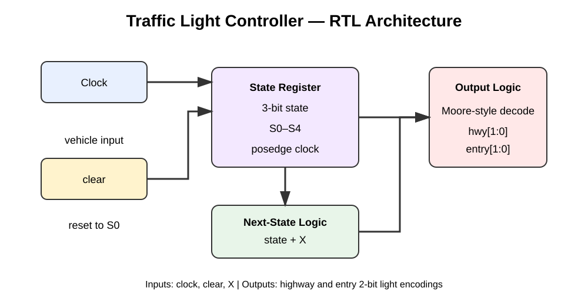
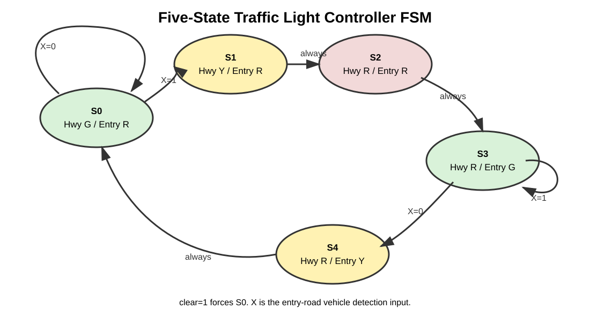

# Traffic Light Controller using VLSI

A Verilog HDL implementation of a synchronous Finite State Machine (FSM) based Traffic Light Controller for a highway (`hwy`) and entry road (`entry`). The project was developed as a mini-project in the Department of Electronics and Communication Engineering at BLDEA’s V.P. Dr. P.G. Halakatti College of Engineering and Technology, Vijayapur, during the academic year 2025–26.

## Project Information

| Item | Details |
|---|---|
| Project | Traffic Light Controller using VLSI |
| Authors | Aishwarya Hadimur (2BL23EC008), Patil Soundarya Sanjeev (2BL23EC062) |
| Guide | Dr. Rajeshwari Patil |
| Department | Electronics and Communication Engineering |
| Institution | BLDEA’s V.P. Dr. P.G. Halakatti College of Engineering and Technology, Vijayapur |
| University | Visvesvaraya Technological University (VTU), Belagavi |
| Academic Year | 2025–26 |

## Overview

The controller regulates two roads using a synchronous FSM. A vehicle-detection input `X` determines when traffic waiting on the entry road should be given the right-of-way. An active-high `clear` input returns the controller to its initial highway-priority state.

## Visual Overview

### RTL Architecture



### Five-State FSM



### Waveform Reference

The original project waveform screenshot is not available anymore. Rather than presenting another project's waveform as if it were yours, the repository includes an external traffic-controller waveform as a **reference visual only**. It demonstrates the kind of ModelSim waveform used to verify an FSM traffic controller. The repository's own waveform can be regenerated at any time using the included testbench and GTKWave commands below.


*External reference visual: IJRASSET, “Design and Simulation of an Optimized Traffic Controller Using Moore FSM.”*

## State Sequence Used in the Verilog Design

| State | Highway | Entry Road | Transition condition |
|---|---|---|---|
| `S0` | Green | Red | Stay in `S0` until `X=1` |
| `S1` | Yellow | Red | Next state `S2` |
| `S2` | Red | Red | Next state `S3` |
| `S3` | Red | Green | Stay while `X=1`; otherwise `S4` |
| `S4` | Red | Yellow | Next state `S0` |

The light encoding is:

- `RED = 2'b00`
- `YELLOW = 2'b01`
- `GREEN = 2'b10`

## Architecture

```text
                 +------------------+
 Clock --------->| State Register   |<----- clear
                 +--------+---------+
                          |
                          v
                 +------------------+
 X ------------->| Next-State Logic |
                 +--------+---------+
                          |
                          v
                 +------------------+
                 | Output Logic      |
                 +----+---------+----+
                      |         |
                      v         v
                  Highway     Entry
                   [2-bit]    [2-bit]
```

## Repository Structure

```text
Traffic-Light-Controller-using-VLSI/
├── README.md
├── LICENSE
├── .gitignore
├── images/
│   ├── README.md
│   ├── architecture_block_diagram.svg
│   └── fsm_state_diagram.svg
├── docs/
│   ├── DESIGN.md
│   └── PROJECT_REPORT.md
└── src/
    ├── traffic_signal.v
    └── tb_traffic_signal.v
```

## Simulation

The design can be simulated with Icarus Verilog and viewed using GTKWave.

### Compile

```bash
iverilog -o traffic_sim src/traffic_signal.v src/tb_traffic_signal.v
```

### Run

```bash
vvp traffic_sim
```

The testbench generates `traffic_signal.vcd`.

### View Waveform

```bash
gtkwave traffic_signal.vcd
```

Add the clock, `clear`, `X`, `hwy`, and `entry` signals in GTKWave to inspect the state/output behavior.

## Tools

- Verilog HDL
- Icarus Verilog
- GTKWave
- Vivado (compatible simulation environment)
- Yosys Open Synthesis Suite (optional synthesis flow)

## Verification

The supplied testbench exercises reset, no-vehicle conditions, vehicle arrival, a vehicle remaining on the entry road, vehicle departure, and another vehicle arrival. The waveform can be used to verify state transitions and output combinations.

## Advantages

- Deterministic FSM-based operation
- Simple RTL architecture
- Low hardware overhead
- Easy modification and scalability
- Suitable for FPGA-oriented digital design study

## Applications

- Road intersections
- Pedestrian crossings
- Highway merging lanes
- Multi-lane traffic systems
- Smart-city traffic management
- Emergency traffic diversion control
- Railway crossing signals
- Industrial automation gates

## Future Scope

- Sensor-based adaptive traffic timing
- AI/ML-assisted traffic prediction
- Emergency vehicle priority
- IoT/cloud monitoring
- Solar-powered traffic controllers
- CCTV and image-processing based vehicle detection

## Project Documentation

A structured project report and design notes are available under [`docs/`](docs/). Visual assets are available under [`images/`](images/).

## References

1. Samir Palnitkar, *Verilog HDL: A Guide to Digital Design*.
2. M. Morris Mano, *Digital Design*, Pearson Education.
3. Nazeih M. Botros, *HDL Programming (VHDL & Verilog)*.
4. IEEE Xplore traffic-light-controller research literature.
5. Icarus Verilog documentation.
6. GTKWave User Manual.
7. Yosys Open Source Synthesis Suite documentation.
8. FPGA4Student HDL tutorials.
9. TutorialsPoint Verilog Programming Guide.
10. Open-source VLSI documentation.

## Academic Note

This repository contains the implementation and documentation of an academic mini-project. The repository's state table above reflects the **five-state FSM present in the supplied Verilog source code** (`S0`–`S4`).
